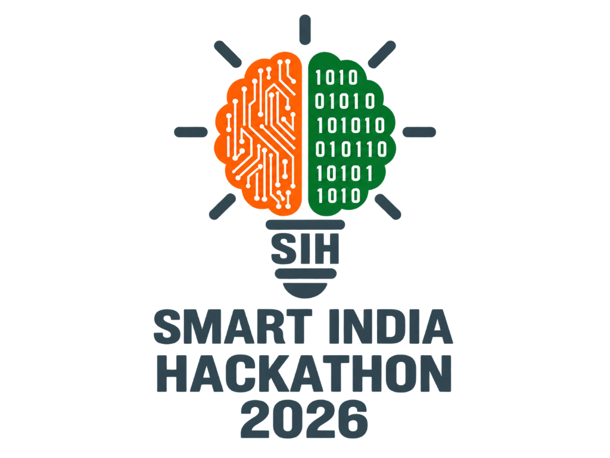

<div align="center">



# ⚖️ THEMIS
### Automated Legal Metrology Packaged Commodity Compliance & Field Enforcement System


*Built for the Directorate of Legal Metrology • Ministry of Consumer Affairs, Food & Public Distribution*

</div>

---

## 📌 What is THEMIS?

**THEMIS** is an automated field inspection system that empowers Legal Metrology officers to audit retail packaged goods in seconds using their smartphone camera.

- 📸 **Instant Packaging Audit**: Replaces manual measuring tapes and paper checklists with on-device camera scanning.
- 🤖 **AI OCR & Rule Engine**: Automatically extracts text and verifies mandatory declarations (MRP, Net Quantity, Dates, Manufacturer info, and Numeral Heights) under the **Legal Metrology Act, 2009** & **LMPC Rules, 2011**.
- 📑 **Instant Legal Reports**: Calculates compounding liabilities under the **Jan Vishwas Act, 2023** and generates digitally certified **Show-Cause Notices (PDF)** and **RFC 4180 CSV audit logs** directly on mobile.

---

## ⚡ Tech Stack

| Component | Technologies Used | Key Purpose |
|---|---|---|
| **Backend Engine** (`Themis/`) | **Rust**, **Axum**, **ONNX Runtime CPU**, **PP-OCRv4** | High-concurrency async REST API, millisecond-latency OCR inference, statutory legal rule validation. |
| **Mobile Frontend** (`my-app/`) | **React Native**, **Expo SDK 54**, **Expo Router v6**, **TypeScript** | Cross-platform mobile app (Android & iOS), camera capture, real-time audit reports, on-device PDF/CSV export. |

---

## 📁 Repository Structure (What is Where?)

```
SIH/
│
├── 🦀 Themis/                 # BACKEND ENGINE (Rust)
│   ├── themis/src/api/        # REST API endpoints & multipart binary image streaming
│   ├── themis/src/ocr/        # Multi-threaded ONNX PP-OCRv4 computer vision pipeline
│   ├── themis/src/compliance/ # Statutory rule evaluators (Rule 6, Rule 7, Rule 13)
│   └── dataset/               # Statutory act regulations (PDFs) & sample benchmark products
│
└── 📱 my-app/                 # MOBILE CLIENT (React Native / Expo)
    ├── app/                   # Expo Router screens (Login, Dashboard, Scanner, Reports)
    ├── assets/UI/             # Field UI screenshots, sample certified PDFs & CSV logs
    ├── src/                   # Authentication context, API services, and data formatters
    └── doc/                   # Detailed 8-chapter technical engineering documentation
```

---

## 🚀 Quickstart (How to Run)

### 1. Start the Backend Engine:
```bash
cd Themis
cargo run --release
```
*(Server binds to `http://localhost:8080`)*

### 2. Start the Mobile Client:
```bash
cd my-app
npm install
npx expo start
```
*(Scan the terminal QR code with the **Expo Go** app on your phone. The app auto-discovers your laptop's IP address).*

#### 🔑 Pre-Configured Test Credentials:
- **Director:** `admin` / `admin@themis2026`
- **Inspector:** `inspector` / `inspector@themis2026`

---

<div align="center">

## 👥 Engineering Team

*Built with dedication for **Smart India Hackathon (SIH 2026)** by:*

<br />

| <a href="https://github.com/kamleshchandela"><br />**Kamlesh Chandela**</a><br />[@kamleshchandela](https://github.com/kamleshchandela) | <a href="https://github.com/rishi919-rgb"><br />**Rishikesh Singh**</a><br />[@rishi919-rgb](https://github.com/rishi919-rgb) | <a href="https://github.com/Souvik6222"><br />**Souvik Biswas**</a><br />[@Souvik6222](https://github.com/Souvik6222) |
|:---:|:---:|:---:|
| <a href="https://github.com/atulXdev"><br />**Atul Singh**</a><br />[@atulXdev](https://github.com/atulXdev) | <a href="https://github.com/Hetavi-Panchotia"><br />**Hetavi Panchotia**</a><br />[@Hetavi-Panchotia](https://github.com/Hetavi-Panchotia) | <a href="https://github.com/PalDPathak404"><br />**Pal Pathak**</a><br />[@PalDPathak404](https://github.com/PalDPathak404) |

<br />

**Smart India Hackathon 2026 • Problem Statement 26034**  
*Directorate of Legal Metrology • Ministry of Consumer Affairs, Food & Public Distribution*

</div>
