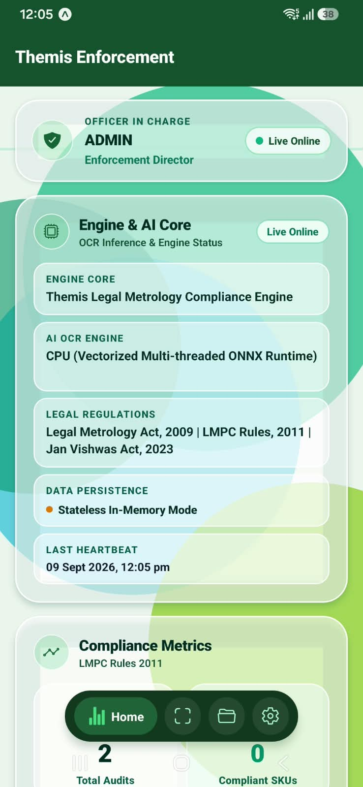
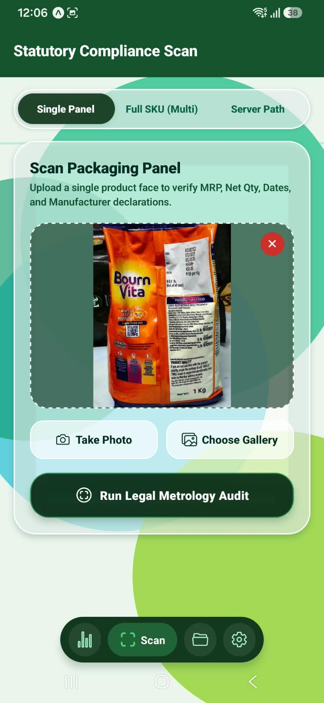
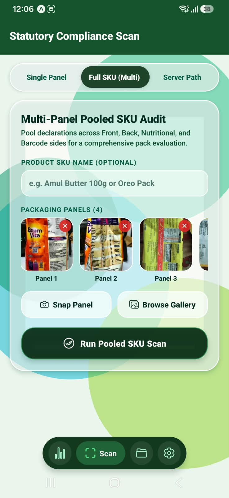
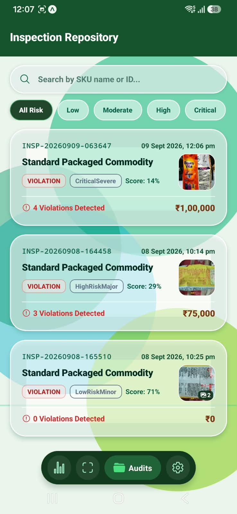
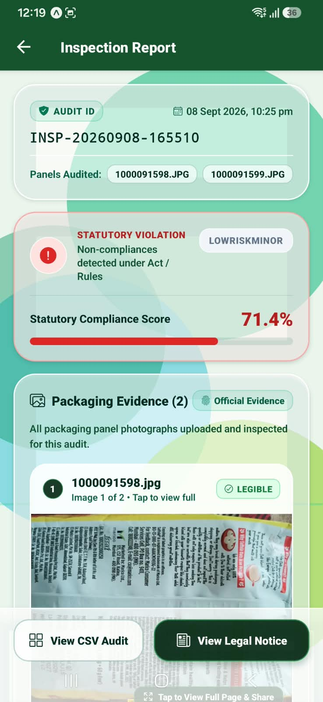
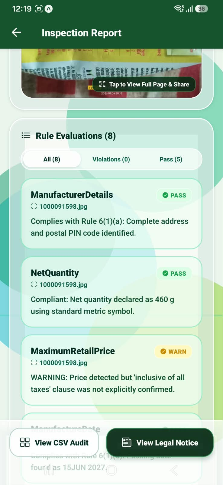
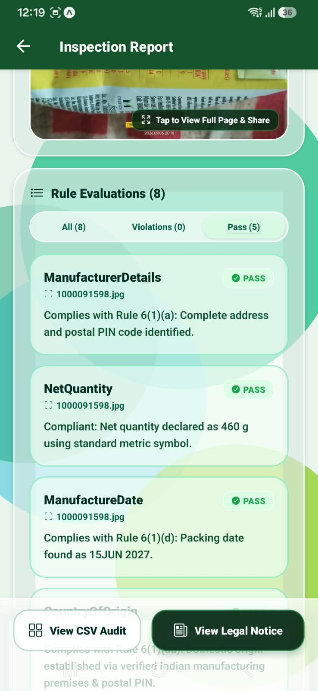
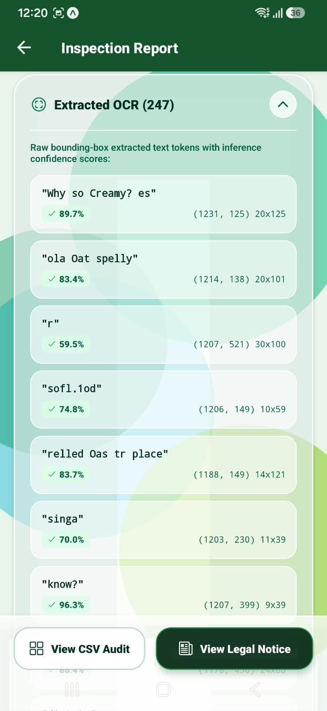
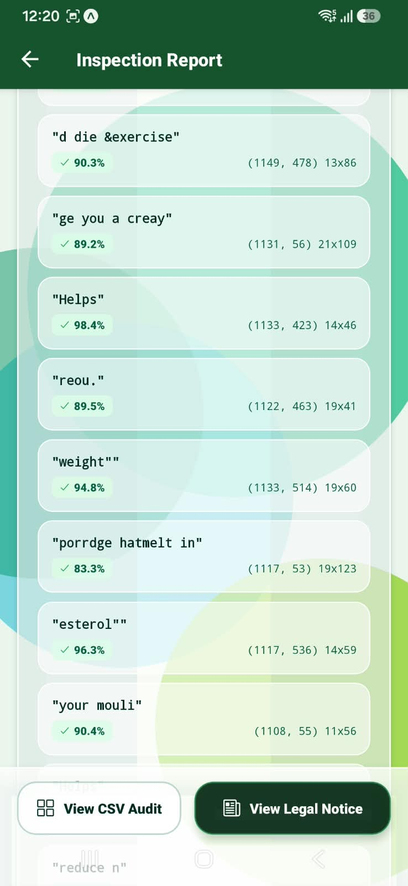
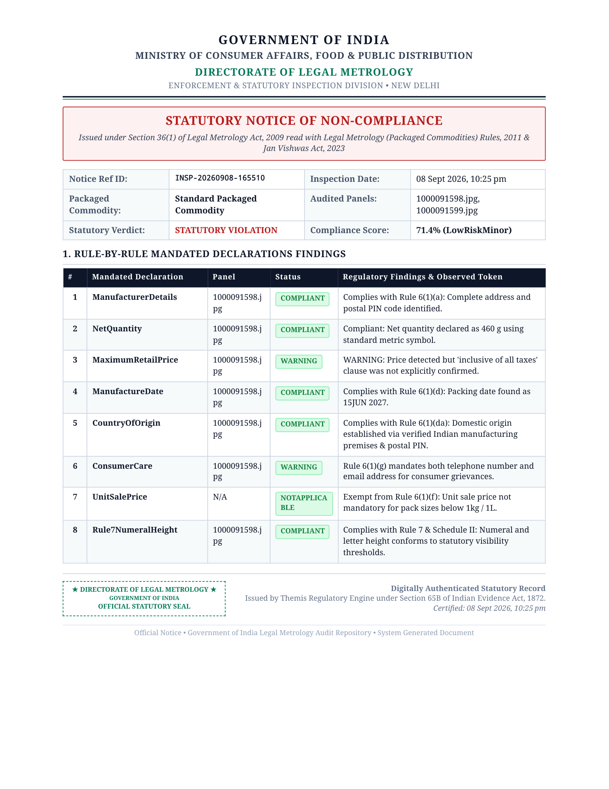

# 05 — Screen-by-Screen Deep Dive & User Flows

> **An easy-to-read, comprehensive guide explaining every screen, user journey, visual element, and backend interaction in the Themis Mobile application.**

---

## 🧭 Application Navigation Map

Themis Mobile consists of **9 dedicated screens** designed to make field enforcement fast, intuitive, and foolproof:

```
THEMIS MOBILE APPLICATION
│
├── 1. Authentication Layer
│   └── app/login.tsx                     # Officer Login, Role Selection & Server Configuration
│
├── 2. Primary Navigation (Bottom Tab Bar)
│   ├── app/(tabs)/index.tsx              # Dashboard: Live Engine Telemetry & Compliance Metrics
│   ├── app/(tabs)/scan.tsx               # Packaging Scanner: Single-Panel, Multi-Panel & Server Path
│   ├── app/(tabs)/inspections.tsx        # Inspection Repository: Search & Historical Audits
│   └── app/(tabs)/settings.tsx           # Settings: Connection Overrides & Officer Profile
│
└── 3. Detail & Statutory Document Views (Stack Screens)
    ├── app/result.tsx                    # Detailed Audit Report: Scores, Findings & Compounding Fines
    ├── app/csv-viewer.tsx                # In-App CSV Spreadsheet Table & Instant Sharing
    ├── app/pdf-viewer.tsx                # In-App Directorate Legal Notice & PDF Generation
    └── app/evidence.tsx                  # Full-Screen High-Resolution Packaging Photo Viewer
```

---

## 1. Login & Role Authentication (`app/login.tsx`)

### 📌 What is this screen for?
This is the security gate of the application. It ensures that only authorized enforcement personnel can conduct inspections, view historical audits, or issue legal show-cause notices.

### 🎯 Why is it important?
The app separates duties between **Enforcement Directors (Admins)** (who have full legal notice issuance and telemetry authority) and **Field Inspectors** (who perform routine retail market surveillance).

### 🔍 Visual UI Breakdown:
* **Government Header**: Official emblem of the Directorate of Legal Metrology citing Smart India Hackathon Problem Statement 26034.
* **Server Address Box**: Displays the current backend URL (e.g. `http://192.168.1.64:8080`) with an instant edit button.
* **Role Selector Pills**: Toggle between `Field Inspector` and `Enforcement Director`.
* **Quick-Fill Demo Chips**: One-tap buttons to fill testing credentials without typing on mobile keyboards.
* **Secure Password Field**: Includes an eye-toggle button to show or hide the password.

### ⚙️ What happens behind the scenes?
1. The user taps **"Sign In as Inspector"** or **"Sign In as Director"**.
2. The app sends a `POST /api/v1/auth/login` request with the credentials.
3. The backend validates the password and returns a secure **JWT Bearer Token**.
4. The app saves the token securely in `AsyncStorage` and navigates to the **Dashboard**.

---

## 2. Live Dashboard & Telemetry (`app/(tabs)/index.tsx`)

### 📌 What is this screen for?
The Dashboard is the operational home screen. It gives the officer an instant snapshot of the AI Engine's health and a summary of all packaged commodity audits conducted so far.

### 🖼️ Visual Interface:
| 1. Officer In Charge & AI Engine Core | 2. Live Statutory Compliance Metrics |
|:---:|:---:|
|  |  |
| *Top Bar: Logged-in officer status, live ONNX AI inference pipeline status, and statutory acts enforced.* | *Bottom Section: Total audits conducted, pass rate, and total Jan Vishwas compounding penalties.* |

### 🔍 Step-by-Step UI Breakdown:
1. **Officer In Charge Bar**:
   - Displays the logged-in officer's name (`ADMIN`) and role (`Enforcement Director`).
   - Shows a pulsating green dot with `Live Online` confirming an active session.
2. **Engine & AI Core Status Card**:
   - **Telemetry Header**: A hardware microchip icon with a live connection badge (`Live Online`).
   - **Engine Core**: Displays *Themis Legal Metrology Compliance Engine*.
   - **AI OCR Engine**: Confirms the active machine learning runtime: *CPU (Vectorized Multi-threaded ONNX Runtime)*.
   - **Enforced Acts**: Explicitly cites the governing Indian laws:
     - *Legal Metrology Act, 2009*
     - *Legal Metrology (Packaged Commodities) Rules, 2011*
     - *Jan Vishwas (Amendment of Provisions) Act, 2023*
   - **Data Persistence**: Shows whether records are stored in PostgreSQL or in Stateless In-Memory mode.
   - **Last Heartbeat**: Real-time timestamp of the last successful server ping.
3. **Compliance Metrics Grid (2x2 Cards)**:
   - **Total Audits**: Total number of packaging audits performed (e.g. `2`).
   - **Compliant SKUs**: Products that met 100% of all legal rules (e.g. `0`).
   - **Non-Compliant**: Products found violating mandatory declarations (e.g. `2`).
   - **Pass Rate**: Percentage of fully compliant packages (e.g. `0%`).
4. **Jan Vishwas Act Compounding Liabilities**:
   - A prominent amber/gold card displaying the total compounding fines calculated across all audited non-compliant products (e.g. `₹75,000`).
5. **Quick Action**:
   - Large green button **"Start New Product Audit"** that jumps directly to the packaging scanner.

---

## 3. Multi-Modal Packaging Scanner (`app/(tabs)/scan.tsx`)

### 📌 What is this screen for?
This is the primary tool used during field inspections. Officers can take photos of product packages using their smartphone camera, select photos from their gallery, or test high-resolution image sets stored on the server.

### 🖼️ Visual Interface (3 Scanning Modes):
| Mode 1: Single Panel Scan | Mode 2: Multi-Panel Pooled SKU | Mode 3: Server Path Audit |
|:---:|:---:|:---:|
|  |  |  |
| *Fast single-photo capture for spot checks.* | *Pools Front, Back, Nutritional, and Barcode sides.* | *Direct audit of server-hosted image folders.* |

### 🔍 How Each Mode Works:

#### Mode 1: Single Panel Scan (`Single Panel`)
* **When to use**: When the officer wants a quick verification of one specific panel (e.g. checking the MRP sticker or manufacturing date).
* **Workflow**:
  1. Tap **"Take Photo"** (opens native camera) or **"Choose Gallery"** (selects photo).
  2. The captured image is previewed with an instant delete `(X)` button.
  3. Tap **"Run Legal Metrology Audit"**.
  4. The app streams the single photo via multipart HTTP to `/api/v1/scan` and opens the report within seconds.

#### Mode 2: Full SKU Multi-Panel Pooled Audit (`Full SKU (Multi)`) — *Recommended*
* **When to use**: Real-world retail packages (like biscuit packets, shampoo bottles, or cereal boxes) distribute required information across multiple sides:
  - *Front Panel*: Product Name & Net Quantity.
  - *Back Panel*: Manufacturer Address, Customer Care, Country of Origin.
  - *Side Panel*: MRP, Batch Number, Manufacturing Date.
* **Workflow**:
  1. Optionally enter the Product SKU Name (e.g. *"Bourn Vita 1 Kg"* or *"Amul Butter 100g"*).
  2. Tap **"Snap Panel"** or **"Browse Gallery"** to add as many panels as needed (`Panel 1`, `Panel 2`, `Panel 3`, `Panel 4`).
  3. Review thumbnails in the horizontal carousel. Remove any blurry shots with the red `(X)` button.
  4. Tap **"Run Pooled SKU Scan"**.
  5. The app sends all images to `/api/v1/scan-sku`. The backend pools all text detections across all panels and evaluates the commodity as a complete unit!

#### Mode 3: Server Path Audit (`Server Path`)
* **When to use**: Designed for lab testing, automated batch verification, and inspecting pre-loaded high-resolution image datasets already stored on the server.
* **Workflow**:
  - Enter the absolute file path or directory path (e.g. `e:/SIH/Themis/dataset/...`).
  - Tap **"Audit Server Image File"** or **"Audit Entire Product Folder"**.

---

## 4. Inspection Repository & History (`app/(tabs)/inspections.tsx`)

### 📌 What is this screen for?
Enables officers to search, browse, and review past field inspections stored in the centralized Themis database.

### 🖼️ Visual Interface:
<div align="center">



</div>

### 🔍 Step-by-Step UI Breakdown:
1. **Search Bar**: Real-time text search. Type any product brand name, commodity type, or Inspection ID (e.g. `INSP-20260909`).
2. **Risk Severity Filter Pills**: Instant one-tap filtering:
   - **All Risk**: Shows all inspections.
   - **Low**: Minor technical irregularities with low risk.
   - **Moderate**: Moderate non-compliance.
   - **High**: Serious omissions (e.g. missing MRP or missing manufacturer).
   - **Critical**: Severe statutory infractions with maximum penalties.
3. **Inspection History Cards**:
   Each card clearly summarizes:
   - **Unique Audit ID**: (e.g. `INSP-20260909-063647`).
   - **Timestamp**: Exact date and time of inspection (e.g. `09 Sept 2026, 12:06 pm`).
   - **Product Name**: (e.g. *Standard Packaged Commodity / Bourn Vita*).
   - **Status Badge**: `VIOLATION` (red) or `PASS` (green).
   - **Risk Tier Pill**: (e.g. `CriticalSevere`, `HighRiskMajor`, `LowRiskMinor`).
   - **Compliance Score**: Percentage score (e.g. `14%`, `29%`, `71%`).
   - **Violations Count**: Number of legal breaches detected (e.g. `4 Violations Detected`).
   - **Jan Vishwas Penalty**: Total calculated compounding fine (e.g. `₹1,00,000`, `₹75,000`, `₹0`).
   - **Packaging Thumbnail**: Shows a visual thumbnail of the inspected product.
4. **Interactive Action**:
   Tapping any card immediately fetches `/api/v1/inspections/:id` and opens the full audit report.

---

## 5. Enforcement Settings (`app/(tabs)/settings.tsx`)

### 📌 What is this screen for?
Manages the officer's device configuration, network endpoints, and active session.

### 🔍 Key Features:
* **Active Profile**: Displays current username (`admin`), role (`Enforcement Director`), and session validity.
* **Network Host Controls**: Allows officers to manually change the backend URL if the server moves to a different IP or cloud domain.
* **Test Connection Button**: Runs an inline `/health` ping and displays latency and server state.
* **Statutory Framework Citations**: Quick reference guide to relevant sections of the Legal Metrology Act and Jan Vishwas Act.
* **Secure Logout**: Clears session tokens and redirects safely to the login screen.

---

## 6. Comprehensive Statutory Audit Report (`app/result.tsx`)

### 📌 What is this screen for?
This is the core evaluation screen. It translates complex OCR bounding boxes and machine learning outputs into clear, legally actionable findings that any officer or court can understand immediately.

### 🖼️ Visual Interface:
| 1. Header & Compliance Score | 2. Rule Findings with Warnings | 3. Evaluated Declarations Tabs |
|:---:|:---:|:---:|
|  |  |  |

| 4. Jan Vishwas Penalties | 5. OCR Bounding Boxes | 6. Confidence Score List |
|:---:|:---:|:---:|
|  |  |  |

### 🔍 Detailed Section Breakdown:

#### 1. Audit Summary & Score Header
* **Inspection ID**: Tamper-evident reference (e.g. `INSP-20260908-165510`).
* **Audited Panels**: Lists all images analyzed (e.g. `1000091598.JPG`, `1000091599.JPG`).
* **Statutory Verdict Banner**: Large, clear indicator:
  - `STATUTORY VIOLATION` (Red background)
  - `STATUTORY COMPLIANT` (Green background)
* **Risk Tier**: (e.g. `LOWRISKMINOR`, `HIGHRISKMAJOR`, `CRITICALSEVERE`).
* **Compliance Score Progress Bar**: Calculated compliance percentage (e.g. `71.4%`).

#### 2. Official Packaging Evidence
* Displays high-resolution photos of all audited sides.
* Features a green `LEGIBLE` badge confirming that image sharpness is sufficient for legal evidence.
* Tapping any image opens the full-screen zoomable **Evidence Viewer**.

#### 3. Rule-by-Rule Mandatory Declarations
Filter tabs allow toggling between **All (8)**, **Violations (0)**, and **Pass (5)**. Each rule card provides:
* **Manufacturer Details (Rule 6(1)(a))**: `PASS` — Confirms complete name, address, and postal PIN code are present.
* **Net Quantity (Rule 6(1)(b))**: `PASS` — Confirms declared net quantity (e.g. `460 g`) uses approved metric symbols (`g`, `kg`, `ml`, `l`).
* **Maximum Retail Price (Rule 6(1)(c))**: `WARN` — Highlights missing statutory wording (e.g. *"WARNING: Price detected but 'inclusive of all taxes' clause was not explicitly confirmed"*).
* **Date of Manufacture/Packing (Rule 6(1)(d))**: `PASS` — Validates format and identifies packing date (e.g. `15JUN 2027`).
* **Country of Origin (Rule 6(1)(da))**: `PASS` — Confirms domestic or imported origin declaration.
* **Consumer Care Details (Rule 6(1)(g))**: `WARN` — Verifies both telephone number and email address are provided.
* **Unit Sale Price (Rule 6(1)(f))**: `NOT APPLICABLE` — Correctly identifies legal exemptions (exempt for packs below 1kg / 1L).
* **Numeral & Letter Height (Rule 7 & Schedule II)**: `PASS` — Verifies that text size complies with minimum millimeter height thresholds.

#### 4. Statutory Penalties (Jan Vishwas Act, 2023)
* Displays compounding fine calculation for first offenses under **Section 36(1)** and **Section 49**.
* Explains the exact legal consequence if the manufacturer chooses compounding over criminal prosecution.

#### 5. AI Explainability: OCR Tokens & Bounding Boxes
* Expandable accordion showing **247 extracted text tokens**.
* Displays inference confidence percentage (e.g. `98.4%`, `90.3%`, `83.7%`).
* Shows exact spatial bounding box coordinates `(y, x) h x w` proving where on the package each word was detected.

#### 6. Floating Action Buttons:
* **View CSV Audit**: Launches the In-App CSV Spreadsheet Table.
* **View Legal Notice**: Generates the formal Directorate Show-Cause Notice in PDF format.

---

## 7. In-App CSV Spreadsheet Viewer (`app/csv-viewer.tsx`)

### 📌 What is this screen for?
Enables officers to inspect the complete audit as a standard spreadsheet table directly on mobile, and share or export the file as an **RFC 4180 CSV**.

### 🔍 How it Works:
* **Full Data Table**: Smooth horizontal and vertical scrolling.
* **Columns**:
  1. `Field`: The statutory rule evaluated.
  2. `Status`: `Compliant`, `Warning`, `Violation`, or `NotApplicable`.
  3. `Source Panel`: The exact image file containing the declaration.
  4. `Matched Value`: The string extracted from the packaging.
  5. `Remarks`: Clear explanation of compliance or violation.
* **Summary Rows**: Appends overall compliance score, risk tier, and total compounding fine at the bottom.
* **One-Tap Native Sharing**: Tapping **"Share CSV"** writes the file to device cache and opens the native OS share sheet (WhatsApp, Gmail, Drive, AirDrop, etc.).

---

## 8. In-App Statutory Legal Notice (PDF) Viewer (`app/pdf-viewer.tsx`)

### 📌 What is this screen for?
Renders an official, print-ready Government of India Legal Metrology Show-Cause Notice issued under **Section 36(1) of the Legal Metrology Act, 2009**.

### 🖼️ Visual Interface:
<div align="center">



<p><em>The complete print-ready PDF generated directly on-device.</em></p>

</div>

### 🔍 Key Document Components:
1. **Government Letterhead**:
   - `GOVERNMENT OF INDIA`
   - `MINISTRY OF CONSUMER AFFAIRS, FOOD & PUBLIC DISTRIBUTION`
   - `DIRECTORATE OF LEGAL METROLOGY — ENFORCEMENT & STATUTORY INSPECTION DIVISION`
2. **Official Notice Title**:
   - `STATUTORY NOTICE OF NON-COMPLIANCE` (or `CERTIFICATE OF STATUTORY COMPLIANCE` for compliant goods).
3. **Reference Information**:
   - Notice Reference ID (`INSP-20260908-165510`).
   - Inspection Date & Time.
   - List of Audited Packaging Panels.
4. **Statutory Findings Schedule**:
   - Numbered table detailing all 8 statutory rules, observed tokens, and legal findings.
5. **Compounding Schedule (Jan Vishwas Act, 2023)**:
   - Sets out estimated compounding fees and gives the manufacturer 15 days to respond.
6. **Digital Certification Seal**:
   - Authenticated under **Section 65B of the Indian Evidence Act, 1872** for court admissibility.
7. **One-Tap PDF Export**:
   - Powered by `expo-print`. Compiles a clean, standard A4 PDF document that can be printed or shared instantly.

---

## 9. Packaging Evidence Photo Viewer (`app/evidence.tsx`)

### 📌 What is this screen for?
Allows officers to zoom into high-resolution packaging panel photographs to inspect tiny print, barcode lines, batch stamps, or seal integrity.

### 🔍 Features:
* Full-screen, high-contrast dark room viewer.
* Pinch-to-zoom and multi-touch pan controls.
* Header showing the Inspection ID and panel filename (e.g. `1000091598.jpg`).
* One-tap export button to share the original evidence image.
