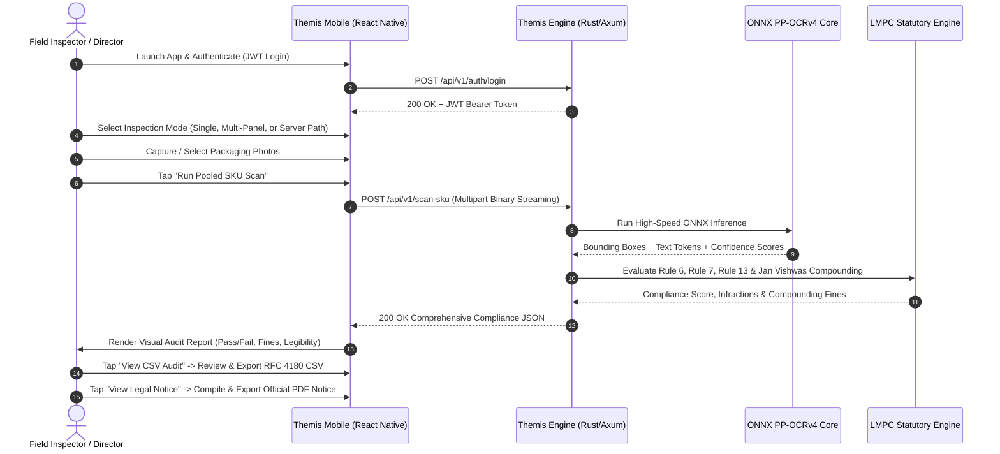
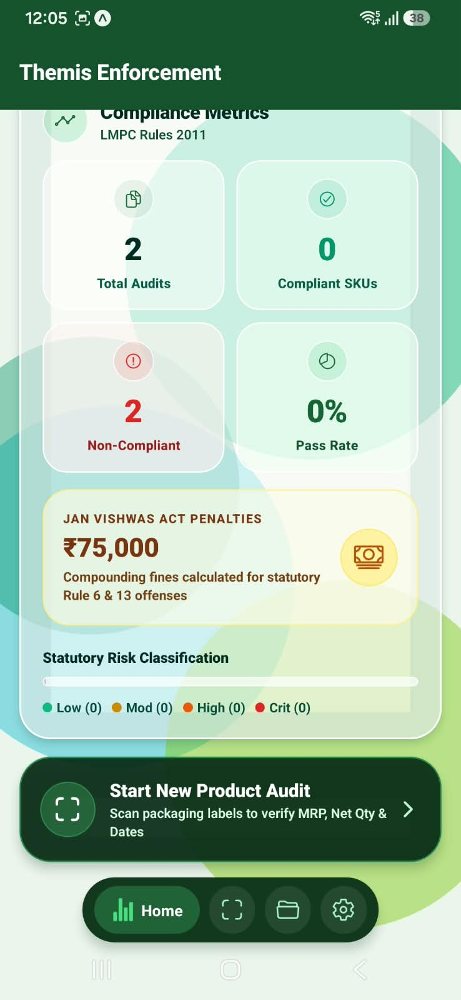
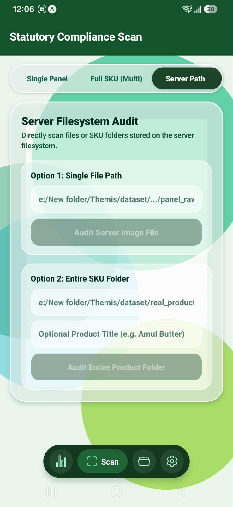
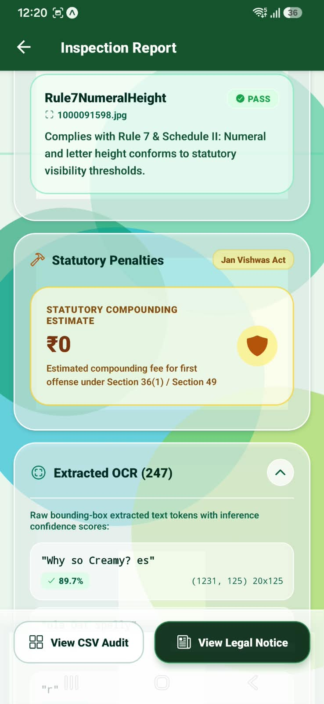

# Themis Mobile — Legal Metrology Field Enforcement Client

<div align="center">


**Next-Generation Mobile Client for Automated Packaged Commodity Compliance Audits**  
*Developed for the Ministry of Consumer Affairs, Food & Public Distribution | Directorate of Legal Metrology*

[Quickstart](#-quickstart--installation) • [System Architecture](#-system-architecture) • [Frontend-Backend Bridge](#-frontend--backend-connection-zero-configuration) • [Workflow](#-end-to-end-enforcement-workflow) • [UI Gallery](#-visual-interface-gallery) • [Statutory Artifacts](#-statutory-outputs-csv--pdf-generation) • [Team & Contributors](#-engineering-team--contributors) • [Documentation](#-documentation-index)

</div>

---

## 🏛️ Executive Summary

**Themis Mobile** is a production-grade, offline-resilient, cross-platform mobile application engineered specifically for field officers of the **Directorate of Legal Metrology**. 

Enforcing compliance under the **Legal Metrology Act, 2009**, the **Legal Metrology (Packaged Commodities) Rules, 2011 (LMPC)**, and the **Jan Vishwas (Amendment of Provisions) Act, 2023** requires inspecting millions of retail packaged goods across manufacturers, warehouses, and distribution points. Manual inspection using tape measures and visual inspection is slow, subjective, and creates massive enforcement backlogs.

Themis Mobile equips field inspectors with an on-device, camera-integrated scanner that streams packaging faces to an AI OCR and Statutory Rules Engine. Within seconds, it returns a deterministic, legally grounded audit verifying mandatory declarations (MRP, Net Quantity, Dates, Manufacturer Info, Country of Origin, and Numeral Heights), estimates statutory compounding fines, and generates exportable **RFC 4180 CSV audit logs** and **official Directorate Show-Cause Notices in PDF format**.

---

## 🏗️ System Architecture

The client communicates seamlessly with the **Themis Rust/Axum Engine** via high-speed RESTful JSON and multipart binary protocols:

```
+---------------------------------------------------------------------------------------+
|                            THEMIS MOBILE FRONTEND (CLIENT)                            |
|             React Native 0.81 | Expo SDK 54 | Expo Router v6 | TypeScript             |
+---------------------------------------------------------------------------------------+
        |                                   |                                   |
        v                                   v                                   v
+------------------+             +--------------------+             +-------------------+
|  PRESENTATION    |             |   AUTHENTICATION   |             |   OFFLINE CACHE   |
|  - Dashboard     |             |   & STATE LAYER    |             |   & ASSET SYNC    |
|  - Scanner (3x)  |             | - AuthContext      |             | - AsyncStorage    |
|  - Audit History |             | - Dynamic Host IP  |             | - Expo FileSystem |
|  - Report Screen |             | - JWT Session Mgr  |             | - Image Resizer   |
+------------------+             +--------------------+             +-------------------+
        |                                   |                                   |
        +-----------------------------------+-----------------------------------+
                                            |
                                            v (HTTP / Multipart REST)
+---------------------------------------------------------------------------------------+
|                         THEMIS BACKEND ENGINE (RUST / AXUM)                           |
|                      Live Port: 8080 | Vectorized CPU Inference                       |
+---------------------------------------------------------------------------------------+
        |                                                                       |
        v                                                                       v
+------------------------------------+             +------------------------------------+
|        AI INFERENCE ENGINE         |             |       STATUTORY RULES ENGINE       |
| - PP-OCRv4 Multi-Threaded Pipeline |             | - Rule 6: Mandatory Declarations   |
| - Spatial Text Token Extraction    |             | - Rule 7: Numeral & Font Height    |
| - Bounding Box Coordinate Mapping  |             | - Rule 13: Standard Metric Units   |
| - Confidence Score Estimation      |             | - Jan Vishwas Act Compounding Calc |
+------------------------------------+             +------------------------------------+
                                            |
                                            v
+---------------------------------------------------------------------------------------+
|                            STATUTORY AUDIT ARTIFACTS                                  |
|        - In-App & Exportable RFC 4180 CSV Audit Dataset (Rule-by-rule findings)       |
|        - Formal Directorate Statutory Notice / Compliance Certificate (PDF)           |
+---------------------------------------------------------------------------------------+
```

---

## 🔌 Frontend & Backend Connection (Zero Configuration)

Connecting physical mobile phones to a local developer server often causes network headaches due to shifting IP addresses on Wi-Fi or mobile hotspots. Themis Mobile solves this completely with **Zero-Config Dynamic Host Discovery**:

### 1. Dynamic Metro Auto-Discovery
The app automatically extracts the development laptop's active IP address from the Metro bundler connection at runtime using `expo-constants`:
```typescript
// bridge.js / src/services/api.ts
import Constants from 'expo-constants';

const debuggerHost = Constants.expoConfig?.hostUri; 
const serverIp = debuggerHost ? debuggerHost.split(':')[0] : 'localhost';
export const BASE_URL = `http://${serverIp}:8080`;
```
* **Result**: When you start `npx expo start` and scan the QR code with your phone (connected to the same Wi-Fi or laptop hotspot), the phone connects directly to your backend on port `8080` without changing a single line of configuration.

### 2. Live Telemetry & Engine Heartbeat
The mobile client continuously tests `/health` and `/stats`. If the backend goes offline, the app displays a clear status pill (`Live Online` green vs `Connecting` blue vs `Offline` red) and offers a one-tap **"Retry Connection"** or **"Change IP"** dialog.

### 3. Runtime IP Override
If running in a custom production or cloud environment, officers can override the backend URL at any time via the **Login Screen** or the **Settings Tab**.

---

## 🔄 End-to-End Enforcement Workflow



### Detailed Workflow Stages:
1. **Officer Authentication**: Field Inspectors and Enforcement Directors log in with role-segregated credentials. Tokens are securely persisted in `AsyncStorage`.
2. **Dashboard Overview**: Displays real-time compliance metrics, total audits conducted, pass rate, active AI engine status, and Jan Vishwas compounding liabilities.
3. **Packaging Capture (3 Scanning Modes)**:
   - **Single Panel**: Fast check of a single package face (e.g. front or back panel).
   - **Full SKU Multi-Panel Pooled Audit**: Uploads multiple sides (Front, Back, Nutrition, Barcode) and evaluates declarations across all surfaces simultaneously.
   - **Server Filesystem Path**: Audits high-resolution datasets directly stored on the engine server.
4. **AI Inference & Rule Evaluation**: The backend extracts all text lines, computes confidence scores, checks mandatory declarations against statutory patterns, measures numeral heights, and calculates fine compounding under the Jan Vishwas Act.
5. **Interactive Audit Report**: Displays compliance status (`COMPLIANT` vs `STATUTORY VIOLATION`), statutory score (e.g. `71.4%`), legibility confirmation, individual rule results, and expandable raw OCR bounding boxes.
6. **Artifact Generation & Export**: Instantly view or share the **RFC 4180 CSV spreadsheet** or compile a **digitally certified Legal Metrology Notice PDF**.

---

## 📸 Visual Interface Gallery

### 1. Dashboard & Live Engine Telemetry
The command center for enforcement officers, showing live backend connectivity, ONNX runtime status, and LMPC compliance metrics.

| Live Engine & Officer Telemetry | Statutory Compliance Metrics |
|:---:|:---:|
|  |  |
| *Active Enforcement Director session, ONNX Runtime CPU inference status, and heartbeat timestamp.* | *2x2 Metrics grid (Total Audits, Compliant SKUs, Pass Rate) and Jan Vishwas penalty liabilities.* |

---

### 2. Multi-Modal Packaging Inspection Scanner
Three flexible scanning workflows tailored for physical field enforcement or batch server evaluations.

| 1. Single Panel Scan | 2. Full SKU Multi-Panel Pooled | 3. Server Filesystem Audit |
|:---:|:---:|:---:|
|  |  |  |
| *Direct single-face upload for rapid field verification of MRP and Dates.* | *Horizontal thumbnail strip pooling Front, Back, Nutritional, and Barcode sides.* | *Direct audit of server-hosted high-resolution SKU folders and image datasets.* |

---

### 3. Historical Inspection Repository
Searchable archive of all historical field inspections with instant risk-tier filtering.

<div align="center">


<p><em>Search by SKU name, filter by risk tiers (<code>CriticalSevere</code>, <code>HighRiskMajor</code>, <code>LowRiskMinor</code>), and inspect past compounding fines.</em></p>

</div>

---

### 4. Comprehensive Statutory Audit Report
Detailed visual findings rendering statutory verdicts, rule-by-rule evidence, and fine estimates.

| 1. Audit Summary & Evidence | 2. Rule Findings with Warnings | 3. Declaration Filter Tabs |
|:---:|:---:|:---:|
|  |  |  |
| *Audit ID `INSP-20260908-165510`, compliance score (71.4%), and photo evidence.* | *Clear warning flags (e.g. MRP missing explicit 'inclusive of all taxes' clause).* | *Interactive tabs filtering between All (8), Violations (0), and Pass (5).* |

---

### 5. Compounding Liabilities & Raw OCR Bounding Boxes
Transparent AI explainability showing the exact raw text tokens, coordinates, and compounding fines under the Jan Vishwas Act.

| 4. Jan Vishwas Compounding Card | 5. Extracted OCR Bounding Boxes | 6. Confidence Score List |
|:---:|:---:|:---:|
|  |  |  |
| *Statutory compounding estimate under Section 36(1) and Section 49.* | *Extracted tokens with spatial bounding box coordinates `(y, x) h x w`.* | *Individual token confidence percentages (e.g. 98.4%, 90.3%) for full audit integrity.* |

---

## 📄 Statutory Outputs: CSV & PDF Generation

Themis Mobile generates two legally certified artifacts directly on-device without requiring external PDF or spreadsheet rendering microservices.

### 1. Official Statutory Notice of Non-Compliance (PDF)
Compiled via `expo-print` using standard A4 typography and issued under Section 36(1) of the Legal Metrology Act, 2009 read with Jan Vishwas Act, 2023. Certified as an electronic record under **Section 65B of the Indian Evidence Act, 1872**.

<div align="center">


<p><em>Sample Generated Notice: <a href="assets/UI/statutory_notice_INSP-20260908-165510.pdf">Download Sample PDF</a></em></p>

</div>

**Notice Components:**
- **Official Seal & Header**: Ministry of Consumer Affairs, Food & Public Distribution | Directorate of Legal Metrology.
- **Reference Identifier**: Unique tamper-evident Inspection ID and date.
- **Rule Findings Schedule**: Comprehensive table listing all 8 statutory declarations, observed tokens, and legal findings.
- **Statutory Compounding Directive**: Citations of applicable legal sections and formal 15-day response requirement.
- **Native Sharing**: One-tap share via WhatsApp, Gmail, AirDrop, or local file save.

---

### 2. RFC 4180 Statutory CSV Audit Log
Tabular audit dataset formatted for automated ingestion into national databases, Excel, or analytics dashboards.

*Sample Generated CSV: [Download Sample CSV](assets/UI/statutory_audit_INSP-20260908-165510.csv)*

#### Sample Data Table:
| Inspection ID | Product SKU | Field | Status | Source Panel | Matched Value | Remarks |
|---|---|---|---|---|---|---|
| `INSP-20260908-165510` | N/A | ManufacturerDetails | Compliant | `1000091598.jpg` | N/A | Complies with Rule 6(1)(a): Complete address and postal PIN code identified. |
| `INSP-20260908-165510` | N/A | NetQuantity | Compliant | `1000091598.jpg` | N/A | Compliant: Net quantity declared as 460 g using standard metric symbol. |
| `INSP-20260908-165510` | N/A | MaximumRetailPrice | Warning | `1000091598.jpg` | N/A | WARNING: Price detected but 'inclusive of all taxes' clause was not explicitly confirmed. |
| `INSP-20260908-165510` | N/A | ManufactureDate | Compliant | `1000091598.jpg` | N/A | Complies with Rule 6(1)(d): Packing date found as 15JUN 2027. |
| `INSP-20260908-165510` | N/A | CountryOfOrigin | Compliant | `1000091598.jpg` | N/A | Complies with Rule 6(1)(da): Domestic origin established via verified Indian manufacturing premises & postal PIN. |
| `INSP-20260908-165510` | N/A | ConsumerCare | Warning | `1000091598.jpg` | N/A | Rule 6(1)(g) mandates both telephone number and email address for consumer grievances. |
| `INSP-20260908-165510` | N/A | UnitSalePrice | NotApplicable | N/A | N/A | Exempt from Rule 6(1)(f): Unit sale price not mandatory for pack sizes below 1kg / 1L. |
| `INSP-20260908-165510` | N/A | Rule7NumeralHeight | Compliant | `1000091598.jpg` | N/A | Complies with Rule 7 & Schedule II: Numeral and letter height conforms to statutory visibility thresholds. |

---

## ⚡ Quickstart & Installation

### 1. Prerequisites
- **Node.js**: v18.x or v20.x+ installed on your workstation.
- **Expo Go App**: Installed on your physical Android device (Google Play Store) or iOS device (Apple App Store).
- **Themis Backend Engine**: Running locally (e.g. in `e:\SIH\Themis`) on port `8080`.

### 2. Installation
Clone the repository and install all dependencies:
```bash
cd "e:\SIH\my-app"
npm install
```

### 3. Launch Development Server
```bash
npx expo start
```
- Metro Bundler will launch in your terminal and print an interactive QR code.
- Ensure your phone is connected to the **same Wi-Fi network or laptop hotspot**.
- Open **Expo Go** on Android (or Camera app on iOS) and scan the QR code.
- The app will build the JavaScript bundle and launch instantly on your device.

---

## 🔐 Default Authentication Credentials

| Role | Username | Password | Operational Permissions |
|---|---|---|---|
| **Enforcement Director (Admin)** | `admin` | `admin@themis2026` | Full access, batch audits, global telemetry, official statutory notice issuance. |
| **Field Inspector** | `inspector` | `inspector@themis2026` | Field SKU scans, rule evaluations, evidence verification, CSV audit exports. |

---

## 📁 Repository Directory Structure

```
my-app/
├── app/                                 # Expo Router File-Based Navigation
│   ├── (tabs)/                          # Bottom Tab Navigator
│   │   ├── index.tsx                    # Dashboard & Engine Telemetry
│   │   ├── scan.tsx                     # Multi-Modal Packaging Scanner
│   │   ├── inspections.tsx              # Historical Inspection Repository
│   │   └── settings.tsx                 # Connection Settings & Officer Profile
│   ├── _layout.tsx                      # Root Stack Layout & Navigation Theme
│   ├── login.tsx                        # JWT Authentication & Role Selector
│   ├── result.tsx                       # Comprehensive Statutory Audit Report
│   ├── csv-viewer.tsx                   # In-App RFC 4180 CSV Spreadsheet Viewer
│   ├── pdf-viewer.tsx                   # In-App Statutory Notice PDF Viewer
│   └── evidence.tsx                     # High-Resolution Evidence Photo Viewer
├── assets/
│   ├── UI/                              # UI Screenshots & Generated Artifacts
│   │   ├── 01_dashboard_live_engine_status.png
│   │   ├── 02_dashboard_compliance_metrics.png
│   │   ├── 03_scan_single_panel_mode.png
│   │   ├── 04_scan_multi_panel_pooled_sku.png
│   │   ├── 05_scan_server_filesystem_path.png
│   │   ├── 06_inspection_repository_history.png
│   │   ├── 07_inspection_report_summary_evidence.png
│   │   ├── 08_inspection_rule_evaluations_warning.png
│   │   ├── 09_inspection_rule_evaluations_filter.png
│   │   ├── 10_statutory_penalties_compounding.png
│   │   ├── 11_extracted_ocr_bounding_boxes.png
│   │   ├── 12_extracted_ocr_confidence_tokens.png
│   │   ├── 13_statutory_notice_pdf_document.png
│   │   ├── statutory_audit_INSP-20260908-165510.csv
│   │   └── statutory_notice_INSP-20260908-165510.pdf
│   └── images/                          # App Icons & Brand Splash
├── doc/                                 # In-Depth Engineering Documentation
│   ├── 01_PROBLEM_STATEMENT_AND_MOBILE_UX_FRAMEWORK.md
│   ├── 02_FRONTEND_TECHNOLOGY_STACK_EVALUATION.md
│   ├── 03_APPLICATION_ARCHITECTURE_AND_STATE_MANAGEMENT.md
│   ├── 04_END_TO_END_API_INTEGRATION_AND_NETWORK_RESILIENCE.md
│   ├── 05_SCREEN_BY_SCREEN_DEEP_DIVE_AND_USER_FLOWS.md
│   ├── 06_DESIGN_SYSTEM_TYPOGRAPHY_AND_STATUTORY_AESTHETICS.md
│   ├── 07_FILE_MANIFEST_AND_ENGINEERING_CHANGELOG.md
│   ├── 08_STATUTORY_REPORTS_CSV_AND_PDF_GENERATION.md
│   └── README.md
├── src/                                 # Core Logic & Utilities
│   ├── context/AuthContext.tsx          # JWT Auth State Management
│   ├── services/api.ts                  # REST API Client & Multipart Streaming
│   ├── types/inspection.ts              # TypeScript Statutory Data Types
│   └── utils/formatters.ts              # RFC 4180 CSV Generator & Currency Formatters
├── package.json                         # Dependencies Manifest
└── tsconfig.json                        # TypeScript Configuration
```

---

## 📚 Documentation Index

For deep-dive technical evaluations, architectural decisions, and regulatory specifications, refer to the `/doc` knowledge base:

| Chapter | Document | Focus Area |
|---|---|---|
| **01** | [**Problem Statement & UX Framework**](doc/01_PROBLEM_STATEMENT_AND_MOBILE_UX_FRAMEWORK.md) | SIH 26034 analysis, field enforcement constraints, zero-dummy-data principles. |
| **02** | [**Technology Stack Evaluation**](doc/02_FRONTEND_TECHNOLOGY_STACK_EVALUATION.md) | Architectural comparison: React Native vs Flutter vs Native Kotlin/Swift. |
| **03** | [**Architecture & State Management**](doc/03_APPLICATION_ARCHITECTURE_AND_STATE_MANAGEMENT.md) | State blueprints, global auth lifecycle, and dynamic host IP bridge. |
| **04** | [**API Integration & Network Resilience**](doc/04_END_TO_END_API_INTEGRATION_AND_NETWORK_RESILIENCE.md) | 12 REST API endpoints, binary streaming, and offline recovery. |
| **05** | [**Screen-by-Screen Deep Dive**](doc/05_SCREEN_BY_SCREEN_DEEP_DIVE_AND_USER_FLOWS.md) | Exhaustive UI breakdown and user flows with embedded screenshots. |
| **06** | [**Design System & Aesthetics**](doc/06_DESIGN_SYSTEM_TYPOGRAPHY_AND_STATUTORY_AESTHETICS.md) | High-contrast palette, typography, and Directorate notice design tokens. |
| **07** | [**File Manifest & Changelog**](doc/07_FILE_MANIFEST_AND_ENGINEERING_CHANGELOG.md) | Chronological development history and full file tree. |
| **08** | [**Statutory Reports: CSV & PDF Generation**](doc/08_STATUTORY_REPORTS_CSV_AND_PDF_GENERATION.md) | Technical architecture of on-device CSV and PDF compilation & sharing. |

---

## 👥 Engineering Team

Themis Mobile was conceptualized, architected, and engineered for **Smart India Hackathon (SIH 2026)** by:

| <a href="https://github.com/kamleshchandela"><br />**Kamlesh Chandela**</a><br />[@kamleshchandela](https://github.com/kamleshchandela) | <a href="https://github.com/rishi919-rgb"><br />**Rishikesh Singh**</a><br />[@rishi919-rgb](https://github.com/rishi919-rgb) | <a href="https://github.com/Souvik6222"><br />**Souvik Biswas**</a><br />[@Souvik6222](https://github.com/Souvik6222) |
|:---:|:---:|:---:|
| <a href="https://github.com/atulXdev"><br />**Atul Singh**</a><br />[@atulXdev](https://github.com/atulXdev) | <a href="https://github.com/Hetavi-Panchotia"><br />**Hetavi Panchotia**</a><br />[@Hetavi-Panchotia](https://github.com/Hetavi-Panchotia) | <a href="https://github.com/PalDPathak404"><br />**Pal Pathak**</a><br />[@PalDPathak404](https://github.com/PalDPathak404) |

---

<div align="center">

**Directorate of Legal Metrology • Government of India**  
*Themis Mobile Client — Smart India Hackathon 2026*

</div>
